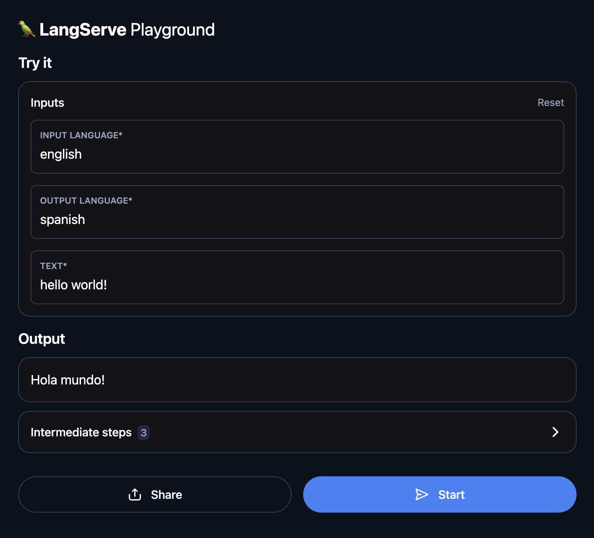

<p align="center">
  
</p>

# LangServe Translator

Simple translation API built with LangChain, LangServe and FastAPI.  
Supports both local LLMs (Ollama / LLaMA) and OpenAI models via an environment variable switch.

Features:
- Prompt-based input schema
- LangServe Playground UI
- Ollama (free, local) support
- OpenAI (paid, optional) support

Installation:
pip install -r requirements.txt

Run with Ollama (default):
ollama pull llama3.2
python app/main.py

Run with OpenAI (optional):
Create a .env file with:
```env
USE_OPENAI=true
OPENAI_API_KEY=your_api_key_here
```
Then run:
python app/main.py

Playground:
Open http://localhost:8000/chain/playground

### LangSmith (Optional):
This project optionally supports LangSmith for tracing and monitoring.
LangSmith is NOT required for the application to run.

If the following environment variables are present in the .env file,
LangChain will automatically send traces to LangSmith:

```env
LANGCHAIN_TRACING_V2=true
LANGCHAIN_API_KEY=your_langsmith_key
LANGCHAIN_PROJECT=project_name
```

If these variables are removed or disabled, the application will continue
to work normally without tracing.